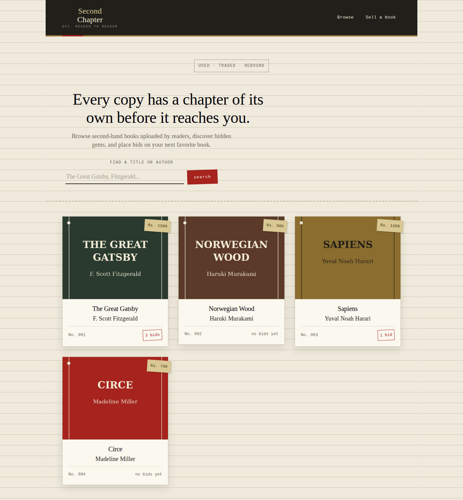
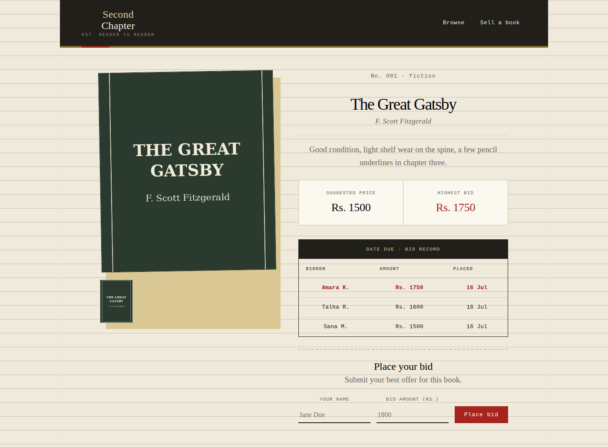
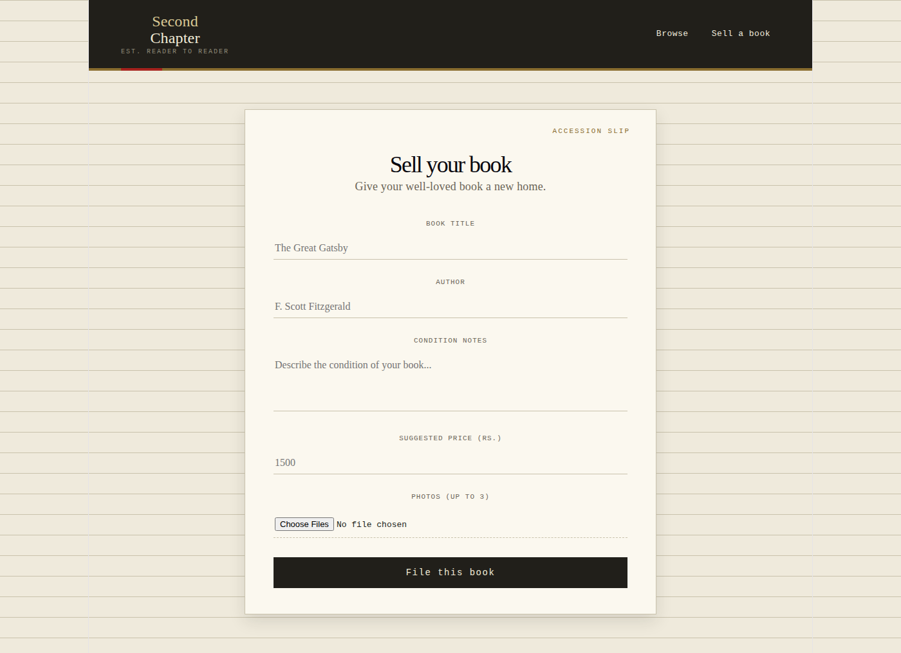

# SecondChapter — Used Book Marketplace

A small full-stack app where readers list used books for sale and others place bids on them.

- **Client:** React 19 (Vite), React Router, Axios
- **Server:** Node.js, Express 5, SQLite3, Multer (image uploads)

## Screenshots

**Browse page**


**Book details, with bid history**


**Sell a book**


## Project structure

```
used-book-marketplace/
├── client/                 React frontend (Vite)
│   ├── src/
│   │   ├── components/     Navbar, BookCard, BidForm
│   │   ├── pages/          Home, AddBook, BookDetails
│   │   ├── App.jsx
│   │   └── main.jsx
│   └── package.json
│
├── docs/
│   └── screenshots/         Screenshots used in this README
│
├── server/                  Express backend
│   ├── database/
│   │   ├── database.js      SQLite connection, applies schema.sql on startup
│   │   ├── schema.sql       Table definitions (Book, BookImage, Bid)
│   │   └── seed.js          Loads the sample dataset
│   ├── routes/
│   │   └── books.js        /books API routes
│   ├── uploads/             Book images (includes 4 sample covers for seeding)
│   ├── database.sqlite      SQLite database file (created on first run)
│   ├── app.js                Server entry point
│   └── package.json
│
└── README.md
```

## Prerequisites

- [Node.js](https://nodejs.org/) v18 or later
- npm (comes with Node.js)

## Setup

Clone the repo, then install dependencies for both the client and the server:

```bash
git clone https://github.com/Nouman0759/used-book-marketplace.git
cd used-book-marketplace

cd server
npm install

cd ../client
npm install
```

## Running the app

The client and server run as two separate processes — start each in its own terminal.

**1. Start the server** (from `server/`):

```bash
cd server
npm run start
```

The API runs at `http://localhost:5000`. On first run it automatically creates `database.sqlite` and applies `database/schema.sql` if the tables don't already exist.

**Load the sample dataset (optional but recommended):**

```bash
npm run seed
```

This clears any existing rows and inserts 4 sample books — with cover images already included under `server/uploads/` — plus a few sample bids, so the app has something to look at right away. Safe to re-run any time; it doesn't touch the schema, only the data.

**2. Start the client** (from `client/`):

```bash
cd client
npm run dev
```

The app opens at `http://localhost:5173`.

> The client currently talks to the API at a hardcoded `http://localhost:5000` — if you run the server on a different port or host, update the URLs in `client/src/pages/Home.jsx`, `AddBook.jsx`, `BookDetails.jsx`, and `client/src/components/BidForm.jsx`.

## API reference

| Method | Endpoint | Description |
|---|---|---|
| GET | `/books` | List all books with thumbnail and bid count |
| GET | `/books/:id` | Get a single book with its images and bid history |
| POST | `/books` | Create a new listing (multipart form: `title`, `author`, `description`, `suggestedPrice`, up to 3 `images`) |
| POST | `/books/:id/bid` | Place a bid (`bidderName`, `bidAmount`) |

## Known limitations

- No authentication — anyone can list a book or place a bid under any name
- No validation that a new bid exceeds the current highest bid
- No listing edit/delete flow yet

## License

Add your license here.